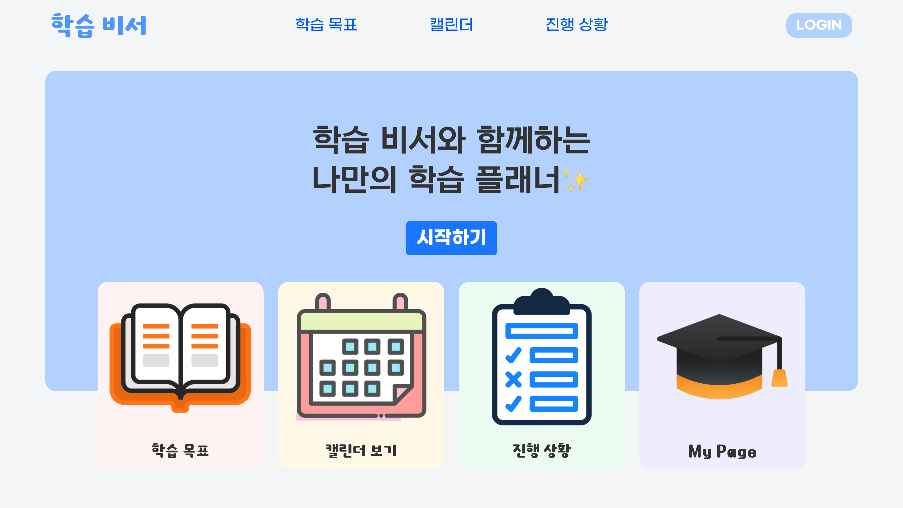

<!-- @format -->

# stuby_plan_project

# MYUDUCK

뮤지컬 관련하여 리뷰 및 정보를 공유하는 사이트를 만들었습니다. 
팀원으로는 강서현, 정해연, 이지영 으로 구성되어 있습니다. 

## 사용 스택

- Front-end :     
- Back-end : 
- Databse : 

## 프로젝트 소개

현대 사회에서는 경쟁이 심화됨에 따라, 개인이 스스로 가치를 증명하고 자기 계발과 학습 능력을 향상시키는 것이 매우 중요해졌습니다. 이제 자기 주도 학습은 선택이 아닌 필수 요소로 자리 잡고 있습니다.

많은 자기 주도 학습 플래너 서비스들이 존재하지만, 기존 서비스는 주로 사용자가 직접 일정을 계획하고 관리하는 기능에 한정되어 있어, 계획 수립과 일정 관리에 어려움을 겪는 사용자에게는 한계가 있습니다.

이 프로젝트는 사용자가 목표와 일정을 입력하면, AI의 도움을 받아 맞춤형 학습 계획과 일정을 생성하고 관리할 수 있도록 지원하는 것을 목표로 합니다.

## 주요 기능

### 캘린더

화면에 달력을 표시하고, 선택한 날짜의 일정을 확인할 수 있습니다.  
기본적으로는 현재 날짜에 해당하는 일정을 보여주며, 사용자는 해당 일정을 쉽게 확인할 수 있습니다.

### 진행 상황

등록한 학습 목표를 리스트로 확인할 수 있으며, 목표에 해당하는 일정 리스트를 확인하고 완료한 일정은 체크하여 저장할 수 있습니다.

### 학습 목표

사용자는 학습 목표와 기간을 설정할 수 있으며, 목표에 맞는 일정을 직접 등록할 수 있습니다.  
또한, Google AI Studio(Gemini API)를 활용하여 입력한 목표와 기간에 맞춘 맞춤형 학습 일정을 생성하고 제안받을 수 있습니다.

### 마이페이지

사용자는 닉네임, 비밀번호, 사용자 이미지를 수정할 수 있으며, 로그아웃 기능을 사용할 수 있습니다.  
또한, 계정을 삭제할 수 있으며, 삭제된 계정은 복구가 불가능합니다.
